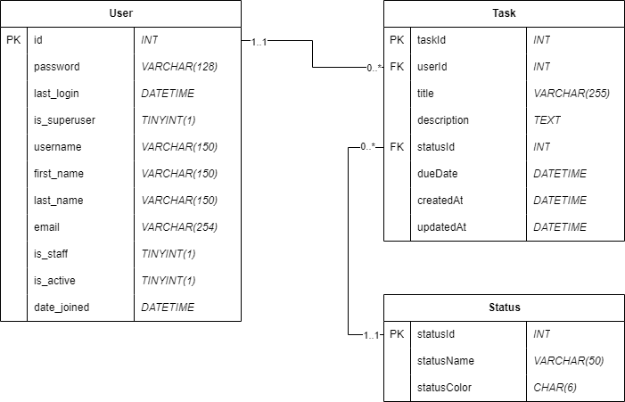

# 1. Table of Contents
- [1. Table of Contents](#1-table-of-contents)
- [2. Getting Started](#2-getting-started)
  - [2.1. Install Django](#21-install-django)
  - [2.2. Review Design](#22-review-design)
  - [2.3. Create Database](#23-create-database)
  - [2.4. Create django project](#24-create-django-project)
- [3. Build an app](#3-build-an-app)
  - [3.1. App URLs](#31-app-urls)
  - [3.2. Project URLs](#32-project-urls)
  - [3.3. Project Apps](#33-project-apps)
  - [3.4. Test](#34-test)
- [4. Configure Database connection](#4-configure-database-connection)
- [5. Create data model](#5-create-data-model)
  - [5.1. Check the migration](#51-check-the-migration)
  - [5.2. Run the migration](#52-run-the-migration)
- [6. Do some testing](#6-do-some-testing)
- [Create some views](#create-some-views)
  - [Update the task list to be better](#update-the-task-list-to-be-better)
  - [Update the task to be better](#update-the-task-to-be-better)


# 2. Getting Started
## 2.1. Install Django
If you haven't already, make sure to [install Django](https://docs.djangoproject.com/en/5.1/topics/install/#installing-official-release)

## 2.2. Review Design
Below is our design for our app, a simple ToDo app.



## 2.3. Create Database
1. Create the `todo` database (note that you don't need any tables yet, Django will do that for us).
    ```sql
    DROP DATABASE IF EXISTS todo;
    CREATE DATABASE todo;
    ```

1. Create a Django user
    ```sql
    CREATE USER IF NOT EXISTS 'django'@'localhost' IDENTIFIED BY 'mysecretpassword';
    ```

1. Give the Django user permissions to the database
    ```sql
    GRANT ALL PRIVILEGES ON todo.* TO 'django'@'localhost' WITH GRANT OPTION;
    ```

## 2.4. Create django project
1. Make sure your terminal is in the correct working directory where you want the app to be saved.
1. `django-admin startproject todo .` will create a todo "project" in the current directory
1. `python manage.py runserver` will start the web server.
1. Navigate to `127.0.0.1:8000`, you should see that Django is running successfully.

# 3. Build an app
A Django project can have many apps, and an app can be in many projects.  Let's build an app to place in our project.

1. `python manage.py startapp todo_app` this will create a new folder called todo_app in the todo project folder
1. Open the `todo_app/views.py` file and add the following code:

```python
from django.http import HttpResponse

def index(request):
    return HttpResponse("CS393 rocks!")
```

## 3.1. App URLs
Since we're trying to add a new URL to our app, we need to update the app's list of available URLs.

Create the file `todo_app/urls.py` with the following content:

```python
from django.urls import path
from . import views

urlpatterns = [
    path("", views.index, name="index"),
]
```

This says that for the todo_app app, we want the root of the path to call the index method in the views.py file; we give it a name of index.

## 3.2. Project URLs
Since we are also adding this app to this project, we need to update the project's URLs.

Go to `todo/urls.py` (NOT `todo_app/urls.py`) and update like below:

```python
from django.contrib import admin
from django.urls import path, include

urlpatterns = [
    path('todo/', include("todo_app.urls")),
    path('admin/', admin.site.urls),
]
```

Here the `include()` function takes the todo_app/urls.py file and injects into into the current urls.py file.

## 3.3. Project Apps
Under todo/settings.py, add the following line to the `INSTALLED_APPS`:
`todo_app.apps.TodoAppConfig`

## 3.4. Test
Run your server and navigate to `http://localhost:8000/todo/`

# 4. Configure Database connection
1. Open todo/settings.py
1. Switch the databases config to the following:
    ```python
    DATABASES = {
        'default': {
            'ENGINE': 'django.db.backends.mysql',
            'NAME': 'todo',
            'USER': 'django',
            'PASSWORD': 'mysecretpassword',
            'HOST': 'localhost',
        }
    }
    ```
1. Run `python manage.py migrate`
1. If successful, you should see a number of new tables under the todo database.

# 5. Create data model
Let's create the data model in Django as outlined by our design diagram.  In the `todo_app/models.py` file, create the following classes:

```python
from django.contrib.auth import get_user_model

class Status(models.Model):
    statusId = models.AutoField(primary_key=True)
    statusName = models.CharField(max_length=50)
    statusColor = models.CharField(max_length=6)

class Task(models.Model):
    taskId = models.AutoField(primary_key=True, verbose_name="Task ID")
    title = models.CharField(max_length=255, null=False)
    description = models.TextField(null=True)
    status = models.ForeignKey(Status, on_delete=models.RESTRICT)
    dueDate = models.DateTimeField()
    createdAt = models.DateTimeField(auto_now_add=True)
    updatedAt = models.DateTimeField(auto_now=True)
```
Note:  we don't have a user yet, but that's ok.

## 5.1. Check the migration
1. Run this command:  `python manage.py makemigrations polls`, it should finish successfully
1. Run this command:  `python manage.py sqlmigrate todo_app 0001` where `0001` is the migration listed from the previous command.
1. Django outputs the SQL commands that it is running to make the new database schema match the current model from your code.

## 5.2. Run the migration
1. Run `python manage.py migrate`
1. Check the tables in the todo database.  You should see todo_app_status and todo_app_task.

# 6. Do some testing
1. Start a new interactive shell `python manage.py shell`
1. Try some of the following sets of commands:

    ```python
    >>> from todo_app.models import Task, Status
    >>> from datetime import datetime
    >>> s = Status(statusName="To Do", statusColor="FF0000")
    >>> s
    >>> s.save()
    >>> s
    >>> t = Task(title="Complete homework 2", status=s, dueDate=datetime(2024,10,30,7,0,0))
    >>> t
    >>> t.save()
    >>> t.status.statusName
    >>> t.description
    >>> t.title
    ```

1. Go back to MySQL and see if you have some new records.  Then try to create your own records!

# Create some views
1. In `todo_app/views.py` add the following lines:

    ```python
    from .models import Task

    def all_tasks(request):
        tasks = Task.objects.order_by("-updatedAt")
        result = "<br />".join([f"{index + 1} - {task.title} : {task.description}" for index, task in enumerate(tasks)])
        print(result)
        return HttpResponse(result)

    def task(request, task_id):
        return HttpResponse(f"You're looking at task {task_id}")
    ```

1. Django also needs to know when to display that information.  So go to `todo_app/urls.py` and add the following two lines to the `urlpatterns`:

    ```python
    path("tasks/", views.all_tasks, name="all tasks"),
    path("tasks/<int:task_id>/", views.task, name="task"),
    ```

1. Save both files and navigate to `http://127.0.0.1:8000/todo/tasks/`.  What do you see?

## Update the task list to be better

Django uses the MVT pattern:  Model - View - Template.  We have a model and a view, but no template, currently.  Let's update our View to use a template.

1. Create the `todo_app/templates/todo_app/` folder.
2. Create a new file in the fodler called `task_list.html`
3. Add the following code to the new template:

    ```html
    
    <ul>
        
        <li>
            <a href="{{ task.taskId }}/">{{ task.title }} - task.description</a>
        </li>
        
    </ul>
    
        <p>No tasks present</p>
    
    ```

1. In the `todo_app/views.py` file, update the `all_tasks` view:

    ```python
    from django.template import loader

    def all_tasks(request):
        all_tasks = Task.objects.order_by("-updatedAt")
        context = {"all_tasks": all_tasks}
        return render(request, "todo_app/task_list.html", context)
    ```

1. Save and reload the page.  You should be able to navigate to the link on the page.

## Update the task to be better

1. Create a new template called `task.html`
2. For now, just put `{{ task }}` as the content.
3. Update the `task` view:

    ```python
    from django.http import Http404

    def task(request, task_id):
        try:
            task = Task.objects.get(pk=task_id)
            context = {"task": task}
        except Task.DoesNotExist:
            raise Http404("Task does not exist or is unauthorized.")
        return render(request, "todo_app/task.html", context)
    ```

4. Save and reload the page.  Try navigating to the new task that you linked.  What about a task id that doesn't exist?