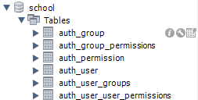

# Table of Contents

# Getting Started

Download the course material from Lesson 23, you will need it for the rest of this guide.

!! If you already have the course content working from the previous lesson (The Academy Management System) you need to run the migrations below.  Otherwise, go back to Lesson 21 and download the relevant course material and get it working before proceeding !!

!! Make sure to make and run the migrations before proceeding !!
1. `python manage.py migrate`
2. `python manage.py makemigrations school_app`
3. `python manage.py migrate --fake school_app 0001` -- since we already have the tables in the database, we tell Django to "pretend" to do the migration but not actually do it.

# Review Schema / Use Cases

## Update Teacher and Student models/schema
1. Open `school_app/models.py`.
2. Add the import statement `from django.contrib.auth.models import User`.
3. Add the User model from the last import as a OneToOne field in both the Student and Teacher models.  Allow it to be nullable and on delete set the value to null.
4. Make and run the school_app migrations.

# Role Based Access Control
A principal idea in computer security is "least privileged access" and "role based access control" (RBAC).  The two topics go hand-in-hand.  A user should only be allowed to do the things that the need to use to complete their jobs. This is called the principle of least privilege and is usually implemented by some form of RBAC.  To implement this, we need users and roles and *authentication*.

## Review Django auth schema

The tables in the image above are related to Django's built-in authorization and authentication methods.  Review the table columns in the tables and see if you can distinguish what each table does.

## Add new roles and users
Normally roles are handled by a database administrator or application administrator.  We are currently serving as both administrators (through Django for the application and through MySQL for the database).  Django calls roles "groups".

Read through the `createusers.py` script.  The script creates two groups in Django, and then creates a "student" User and a "teacher user.  You could execute this script line by line in the shell, or we can add it as a Django command.  Let's add it as a Django command.

### Django Commands
1. In the `school_app` folder, create a `management` folder.
2. In the `management` folder, create a `commands` folder and an empty file called `__init__.py`
3. In the `commands` folder, create an empty file called `__init__.py` and copy in the `createusers.py` file
4. In the end, your folders should look like the image below.
   
    

5. Execute the following command: `python manage.py createusers`.
6. Validate the entries exist in the database as  `SELECT * FROM auth_user` and `SELECT * FROM auth_group`.

## Password Security

Look at the password attribute in the database.  That's not what we typed at all!  This is a great time to learn about password hashing.  Never try to build your own hashing implementation unless you're a cryptography expert (and I mean expert expert).  [Hashing and salting](https://en.wikipedia.org/wiki/Salt_%28cryptography%29) are how passwords are kept secure in databases.

# Add login capability

1. Add login template
2. Add login view
3. Add login url
4. Try logging in as teacher, try logging in as student
5. Logout

## Lockdown views

1. For each use case with a logged-in user, add the `@login_required` decorator before the view
2. For each use case with a role (group), check the user's group and return the HttpResponseForbidden.
3. For each use case with a specific user, only return that user's items.

## Verify lockdown

1. For each use case with a logged-in user, try to view it without logging in.
2. For each use case with a role (group), try to view it in the wrong role
3. For each use case with a specific user, try to view someone else's items.